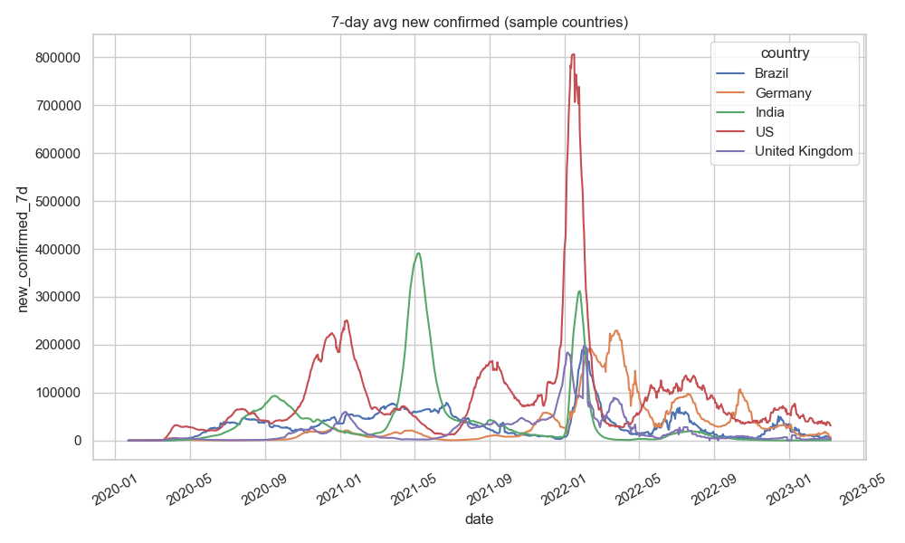
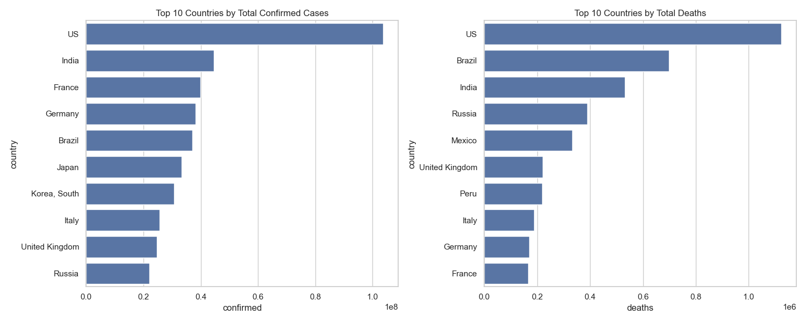
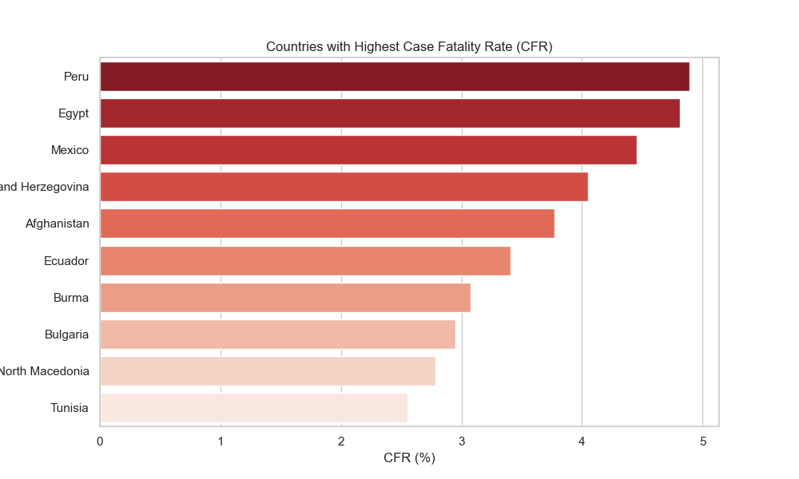
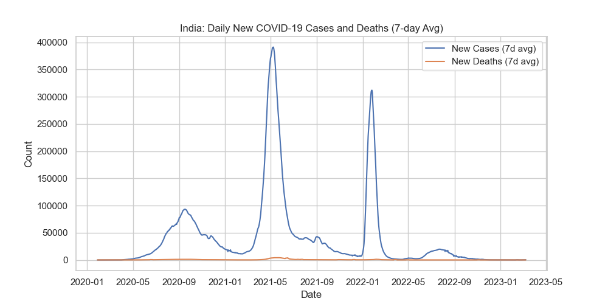
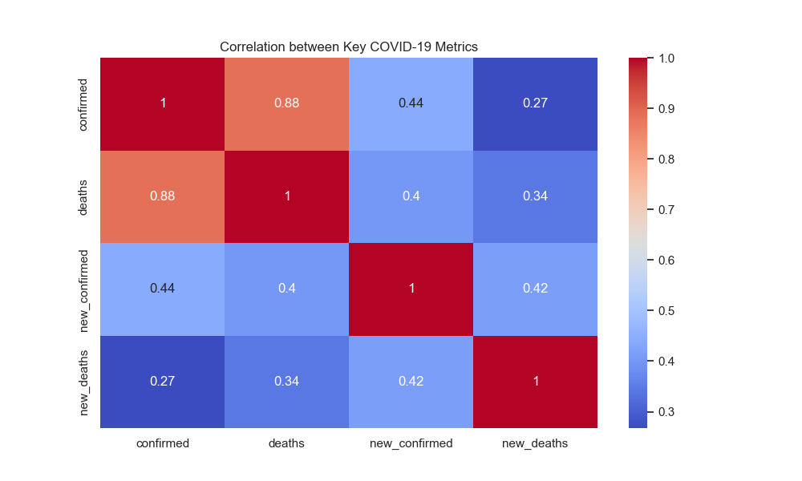

# 🦠 COVID-19 Data Analysis


---

## 🧭 Overview
This project performs **Exploratory Data Analysis (EDA)** on global **COVID-19 data**, focusing on trends in confirmed cases and deaths across countries and over time.  

The goal is to uncover meaningful insights about:
- Which countries were most affected,
- How infection and death trends evolved,
- How data correlates across regions and time.

---

## 🧰 Tech Stack

| Tool | Purpose |
|------|----------|
| 🐍 **Python** | Core programming language for data analysis and visualization |
| 📊 **Pandas** | Data cleaning, manipulation, and tabular analysis |
| 🔢 **NumPy** | Numerical computations and array-based data handling |
| 📈 **Matplotlib** | Plotting library for static visualizations |
| 🎨 **Seaborn** | High-level statistical data visualization built on Matplotlib |
| 🗂️ **Pathlib** | Simplified and reliable file path management |

---

## 📁 Dataset
The dataset is sourced from the **Johns Hopkins University CSSE COVID-19 Data Repository**:  
- [Confirmed Cases CSV](https://github.com/CSSEGISandData/COVID-19/blob/master/csse_covid_19_data/csse_covid_19_time_series/time_series_covid19_confirmed_global.csv)  
- [Deaths CSV](https://github.com/CSSEGISandData/COVID-19/blob/master/csse_covid_19_data/csse_covid_19_time_series/time_series_covid19_deaths_global.csv)

These files are updated periodically and contain cumulative daily counts.

---

## 📊 Visualizations

### 7-day average - new cases (sample countries)


### Top 10 countries by total confirmed cases and deaths


### Case Fatality Rate (CFR)


### Trends for India


### Correlation Heatmap


---


## 🚀 How to Run

```bash
# 1️⃣ Clone the repo
git clone https://github.com/YOUR_USERNAME/covid19-analysis.git
cd covid19-analysis

# 2️⃣ (Optional) Create a virtual environment
conda create -n covid19 python=3.10
conda activate covid19

# 3️⃣ Install dependencies
pip install -r requirements.txt

# 4️⃣ Launch Jupyter Notebook
jupyter notebook notebooks/covid19_analysis.ipynb
